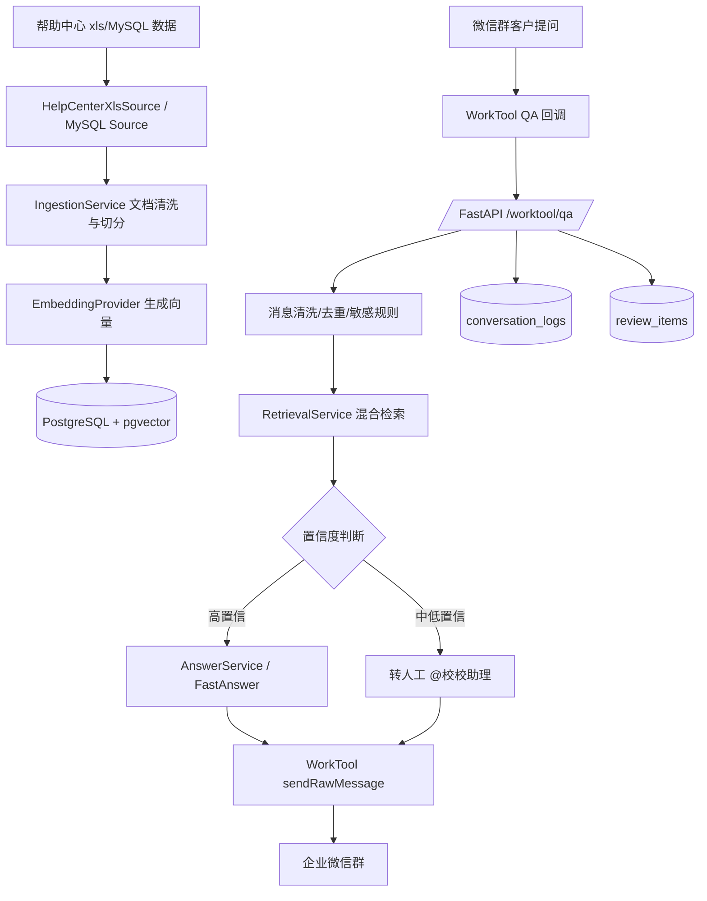

# 企业级微信客服 RAG 系统实现步骤

> 面试讲述版：本文用于说明当前项目从 0 到 MVP 的实现思路、关键技术选择、核心流程、工程落地和后续优化方向。

## 1. 项目目标

本项目目标是为教育 SaaS 帮助中心搭建一个企业级 RAG 客服机器人：

- 将帮助中心文档导入知识库。
- 支持文字和图片资料的可追溯检索。
- 通过 WorkTool 接入企业微信群。
- 群里客户 @ 机器人后，自动检索知识库并生成客服化回答。
- 高置信问题自动回复，中低置信或敏感问题转人工。
- 问答日志沉淀到数据库，后续可审核进入知识库。

当前系统已经跑通的能力包括：

- 帮助中心 5 张表导入：`cate/art/artsubhead/artsubinc/kws`。
- PostgreSQL + pgvector 持久化知识库。
- 混合检索：关键词 + 向量相似度 + rerank。
- DeepSeek/OpenAI-compatible LLM 回答生成。
- WorkTool QA 回调接入。
- 文字 + 图片批量主动发送。
- 低置信度问题自动 @ 人工账号。
- 对话日志、审核池、诊断接口和 systemd 部署。

## 2. 技术栈

| 模块 | 技术选型 | 说明 |
| --- | --- | --- |
| Web 服务 | FastAPI | 提供回调、检索、审核、诊断接口 |
| 数据库 | PostgreSQL + pgvector | 保存文档、chunk、向量、日志、审核池 |
| Embedding | 当前 HashEmbeddingProvider，后续可切 HTTP embedding API | MVP 阶段先保证流程稳定 |
| LLM | DeepSeek OpenAI-compatible API / MockLLM | 生成客服化回答 |
| 文档解析 | BeautifulSoup + xlrd | 清洗 HTML，读取帮助中心 xls 数据 |
| 微信机器人 | WorkTool API | QA 回调 + sendRawMessage 主动发送 |
| 部署 | 阿里云轻量服务器 + systemd | 服务常驻运行 |
| 测试 | pytest | 覆盖导入、检索、回答、WorkTool 请求格式 |

## 3. 总体架构



系统核心分层如下：

- `api_models.py`：定义 WorkTool 回调和接口请求/响应模型。
- `main.py`：FastAPI 入口，处理 `/worktool/qa`、诊断接口、审核接口。
- `container.py`：根据 `.env` 组装 Repository、Embedding、LLM、Adapter。
- `sources/`：帮助中心数据源读取。
- `ingestion.py`：文档清洗、图片引用抽取、chunk 切分、embedding。
- `repositories.py`：内存仓库和 PostgreSQL 仓库。
- `retrieval.py`：混合检索和置信度计算。
- `answering.py`：上下文压缩和 LLM 调用。
- `fast_answer.py`：常见高频问题的快速模板。
- `adapters/wechat.py`：WorkTool 主动发送适配层。
- `review.py`：问答审核和知识沉淀。

## 4. 实现步骤

### 步骤 1：先抽象领域模型

先定义 RAG 系统需要长期维护的核心对象，避免业务逻辑直接依赖数据库表或 WorkTool 字段。

核心模型在 `domain.py`：

- `HelpDocument`：帮助文档原始记录。
- `KnowledgeChunk`：可检索知识分片。
- `ImageRef`：图片 URL、alt、OCR、caption。
- `RetrievalHit` / `RetrievalResult`：检索结果和置信度。
- `AnswerDecision`：回答决策。
- `WechatMessage`：统一后的微信消息。
- `ConversationLog`：客户问题、检索结果、草稿、最终回复。
- `ReviewItem`：待审核知识池条目。

这样后续无论数据源是 xls、MySQL，还是微信机器人从 WorkTool 换成别的 SDK，核心业务层都不用大改。

### 步骤 2：设计持久化仓库接口

在 `repositories.py` 中先定义 `KnowledgeRepository` 协议，再实现两套仓库：

- `InMemoryKnowledgeRepository`：本地测试和单元测试使用。
- `PostgresKnowledgeRepository`：服务器 MVP 使用。

PostgreSQL 仓库负责：

- 写入帮助文档和知识分片。
- 保存 `image_refs`、metadata、embedding。
- 根据关键词和向量召回候选 chunk。
- 保存对话日志和审核池。
- 根据 `message_id` 做去重，避免 WorkTool 重复回调导致重复回复。

选择 PostgreSQL + pgvector 的原因：

- MVP 阶段组件少，备份和运维简单。
- 同时能保存结构化 metadata、日志和向量。
- 适合教育 SaaS 帮助中心这种中小规模知识库。
- 后续数据到百万级 chunk 或检索 QPS 明显升高，再迁移 Milvus/Qdrant。

### 步骤 3：导入帮助中心数据

帮助中心导入逻辑在 `sources/helpcenter_xls.py` 和 `cli.py`。

当前读取 5 张表：

```text
osp_helpcenter_cate.xls
osp_helpcenter_art.xls
osp_helpcenter_artsubhead.xls
osp_helpcenter_artsubinc.xls
osp_helpcenter_kws.xls
```

重建关系：

```text
cate.id -> art.cateid
art.id -> artsubhead.artid
artsubhead.id -> artsubinc.headid
art.id -> kws.artid
```

导入时将数据组装成结构化 HTML：

- 文章标题变成 `<h1>`。
- 小标题变成 `<h2>`。
- 内容块变成 `<p>`。
- `pics` 变成 ``。
- `videos` 保存为视频链接文本。
- `kws` 合并为关键词文本。

导入命令：

```bash
python -m ragbot.cli init-db --schema db/init/001_schema.sql
python -m ragbot.cli rebuild-index --source db/init
python -m ragbot.cli import-helpcenter --source db/init
```

当前服务器导入规模：

```text
documents: 141
chunks: 171
image_refs: 1297
```

### 步骤 4：文档清洗、图片处理和分片

核心逻辑在 `IngestionService`。

处理步骤：

1. 使用 BeautifulSoup 清洗 HTML。
2. 抽取 `` 标签中的图片 URL 和 alt。
3. 图片不直接做图片向量，而是保存 `ImageRef`。
4. 图片的 alt/OCR/caption 会转成文本附加到 chunk。
5. 按段落和标题切分，默认 `max_chunk_chars=900`。
6. 对每个 chunk 调 embedding，写入 `KnowledgeChunk.embedding`。

当前图片策略：

- `image_refs` 保留原始图片 URL。
- OCR/caption 文本参与检索。
- 回答时如果命中图片，会通过 WorkTool 发送相关截图。
- 第一阶段不做多模态图片向量检索，降低复杂度。

这是一个务实选择：帮助文档中的图片主要是截图/操作图，文字说明和图片位置比单独图片向量更重要。

### 步骤 5：Embedding Provider 抽象

Embedding 在 `providers.py` 中抽象为 `EmbeddingProvider`。

当前支持：

- `HashEmbeddingProvider`：本地确定性 embedding，用于 MVP 和测试。
- `HttpEmbeddingProvider`：兼容 OpenAI 风格 `/embeddings` API。

当前服务器使用：

```env
EMBEDDING_PROVIDER=hash
EMBEDDING_DIMENSIONS=64
```

这样先把 RAG 流程跑通。后续切真实中文 embedding 模型时，需要同步修改：

- `.env` 中的 embedding 配置。
- `db/init/001_schema.sql` 中的 `vector(N)` 维度。
- 重新执行 `rebuild-index`。

### 步骤 6：混合检索和置信度判断

检索逻辑在 `RetrievalService`。

召回分两层：

1. `PostgresKnowledgeRepository.find_candidate_chunks`
   - 使用 PostgreSQL `to_tsvector/plainto_tsquery` 做关键词初筛。
   - 使用 pgvector `<=>` 做向量相似度排序。
   - 支持 metadata 过滤，例如 `product_module`。

2. `RetrievalService.retrieve`
   - 对候选 chunk 再算关键词重合分。
   - 再算 cosine similarity。
   - 标题命中增加 `title_boost`。
   - 得到最终 rerank 分：

```text
rerank_score = 0.50 * keyword_score + 0.50 * vector_score + title_boost
```

置信度分三档：

| 档位 | 条件 | 行为 |
| --- | --- | --- |
| High | `score >= AUTO_REPLY_THRESHOLD` | 自动回复 |
| Medium | `score >= DRAFT_ONLY_THRESHOLD` | 默认转人工，部分模板问题可自动答 |
| Low | 分数过低或无结果 | 转人工 |

当前配置：

```env
AUTO_REPLY_THRESHOLD=0.72
DRAFT_ONLY_THRESHOLD=0.50
TOP_K=5
```

### 步骤 7：回答生成和 Prompt 约束

回答逻辑在 `AnswerService`。

流程：

1. 提取 top-k chunk 的正文。
2. 清理图片占位、OCR、caption 等非回答内容。
3. 控制上下文长度，默认 `MAX_LLM_CONTEXT_CHARS=2400`。
4. 低置信度直接不生成答案。
5. 中高置信度调用 LLM 生成客服化回答。
6. 只有高置信度允许自动回复。

LLM Provider 支持：

- `MockLLMProvider`：本地测试。
- `HttpLLMProvider`：DeepSeek / OpenAI-compatible API。

Prompt 的核心约束：

- 只能基于知识片段回答。
- 不知道就转人工。
- 操作类问题用编号步骤。
- 不输出图片占位符、OCR 字样、关键词噪声。
- 语气简洁、礼貌、可执行。

### 步骤 8：高频问题快速回答

为了满足 WorkTool 3 秒回调限制，项目额外实现了 `fast_answer.py`。

用途：

- 对“新建班级”“设备平台要求”“排课”“选不到老师”“学员重置密码”等高频问题直接用模板。
- 避免每次都等待大模型。
- 对带图片问题更快地进入异步图片发送流程。

目前模板覆盖：

- 怎么新建班级。
- 怎么新建班级并添加学生。
- 新建班级后怎么排课。
- 班级创建好了为什么选不到老师。
- 学员忘记密码怎么重置。
- 设备平台要求。

这属于工程上的性能优化，不替代完整 RAG，而是把高频稳定问题前置处理。

### 步骤 9：WorkTool QA 回调接入

WorkTool 回调入口在 `main.py`：

```text
POST /worktool/qa
```

请求字段由 `WorkToolQaCallbackIn` 接收：

- `spoken`
- `rawSpoken`
- `receivedName`
- `groupName`
- `groupRemark`
- `roomType`
- `atMe`
- `textType`
- `fileBase64`
- `messageId`

处理重点：

1. 统一转成 `WechatMessage`。
2. 清理开头 @ 机器人名称，例如 `@翁然`。
3. 支持 WorkTool 特殊空白字符。
4. 使用 `messageId` 去重；如果没有 messageId，则用内容和分钟级 salt 生成 fallback id。
5. 判断是否忽略短消息、非文本消息。
6. 判断是否命中敏感规则。
7. 调用检索和回答链路。
8. 记录日志和审核池。

回调响应格式遵循 WorkTool 文档：

```json
{
  "code": 0,
  "message": "success",
  "data": {
    "type": 5000,
    "info": {
      "text": "回答内容"
    }
  }
}
```

### 步骤 10：解决 3 秒超时和图片回复问题

WorkTool QA 回调要求 3 秒内响应。带图片的回答如果同步生成和发送，很容易超时。

当前方案：

1. 如果命中图片且高置信，先生成快速回答。
2. `/worktool/qa` 快速返回空文本，避免平台等待超时。
3. 后台线程调用 WorkTool `sendRawMessage`。
4. 单次请求中批量发送：
   - `type=203`：文本消息。
   - `type=218`：图片消息。

WorkTool 请求结构示意：

```json
{
  "socketType": 2,
  "list": [
    {
      "type": 203,
      "titleList": ["客户群"],
      "receivedContent": "回答文本"
    },
    {
      "type": 218,
      "titleList": ["客户群"],
      "objectName": "screenshot.jpg",
      "fileUrl": "https://...",
      "fileType": "image"
    }
  ]
}
```

失败降级：

- 如果批量发送失败，降级发送纯文本。
- 如果图片发送失败，文本回答不受影响。
- 通过 `/worktool/raw-results` 查询安卓端实际执行结果。

### 步骤 11：中低置信问题转人工

转人工逻辑在 `main.py`：

触发条件：

- 敏感词命中，例如报价、合同、退款、赔偿、发票。
- 检索置信度低。
- 只有草稿但未达到自动回复标准。

转人工配置：

```env
HUMAN_HANDOFF_ENABLED=true
HUMAN_HANDOFF_MENTION_NAME=校校助理
HUMAN_HANDOFF_MESSAGE_PREFIX=稍等老师，这个问题 @{mention} 帮您看下，尽快回复您。
HANDOFF_RULES_PATH=config/handoff_rules.json
```

机器人会主动发送：

```text
稍等老师，这个问题 @校校助理 帮您看下，尽快回复您。
```

WorkTool 请求体同时携带：

```json
{
  "atList": ["校校助理"]
}
```

转人工不复述客户原问题，避免群里重复刷屏；这样客户群里不会出现机器人沉默，同时也能避免低置信问题被模型胡编。

当前质量规则已经配置化：

- `config/query_aliases.json`：检索 query rewrite 同义词。
- `config/handoff_rules.json`：转人工关键词。
- `config/fast_answer_templates.json`：高频快速回答模板。

每天可以通过 `/quality/report` 或 `python -m ragbot.cli quality-report` 查看低置信、转人工、无答案问题 Top 列表，作为下一轮补知识和调检索的输入。

### 步骤 12：问答日志和审核闭环

每次客户提问都会写入：

- `conversation_logs`
  - 群 ID
  - 用户 ID
  - message_id
  - 原问题
  - 置信度
  - 命中的 chunk id
  - draft answer
  - final answer
  - 是否自动回复
  - 是否需要人工

- `review_items`
  - conversation_id
  - question
  - answer
  - status
  - reviewer_id

审核逻辑在 `review.py`：

- `GET /reviews` 查看待审核问题。
- `POST /reviews/{id}/approve` 审核通过。
- `POST /reviews/{id}/reject` 驳回。

审核通过后，会把高质量问答重新作为 `HelpDocument` 进入 `IngestionService`，生成新的 chunk 和 embedding，形成知识闭环。

### 步骤 13：诊断和运维接口

为了排查 WorkTool 链路，增加了几个诊断接口：

```text
GET /worktool/online
GET /worktool/qa-logs?size=10
GET /worktool/raw-messages?size=10
GET /worktool/raw-results?size=10
```

使用方式：

- `/worktool/online`：确认机器人是否在线。
- `/worktool/qa-logs`：确认 WorkTool 是否真的回调了 `/worktool/qa`。
- `/worktool/raw-messages`：确认服务端是否调用了主动发送接口。
- `/worktool/raw-results`：确认安卓端是否真的发送成功。

服务器常用命令：

```bash
sudo systemctl status worktool-rag --no-pager
sudo systemctl restart worktool-rag
sudo journalctl -u worktool-rag -f
```

数据库检查：

```sql
SELECT count(*) FROM help_documents;
SELECT count(*) FROM knowledge_chunks;
SELECT count(*) FROM conversation_logs;
SELECT count(*) FROM review_items WHERE status = 'pending';
```

### 步骤 14：测试覆盖

当前使用 `pytest`，重点覆盖：

- 文档导入和图片 OCR/caption 占位。
- 检索命中和置信度策略。
- 低置信度不自动回答。
- LLM 上下文压缩。
- WorkTool 回调字段解析。
- WorkTool `sendRawMessage` 请求结构。
- 图片发送 `type=218` 请求结构。
- 文本 + 图片批量发送。
- `atList` 转人工请求结构。
- 快速模板回答。
- 审核通过后写入新知识。

运行：

```bash
python -m pytest
```

当前测试结果：

```text
25 passed
```

## 5. 当前完整问答链路

```text
1. 客户在微信群 @翁然 提问
2. WorkTool 安卓端监听企业微信消息
3. WorkTool 云端 POST 到 /worktool/qa
4. FastAPI 解析 WorkTool 回调
5. 清理 @、特殊空白、生成 message_id
6. 根据 message_id 去重
7. 非文本/短文本直接忽略
8. 敏感问题直接转人工
9. 检索 PostgreSQL + pgvector 知识库
10. 根据 rerank 分数判断 high/medium/low
11. 高频问题走 FastAnswer 模板
12. 普通高置信问题调用 DeepSeek 生成答案
13. 带图问题异步批量发送文本 + 图片
14. 低置信或不确定问题 @校校助理
15. 写入 conversation_logs 和 review_items
16. 人工审核后可回流进正式知识库
```

## 6. 面试时可以重点讲的工程亮点

### 6.1 Adapter 隔离外部平台

业务层只依赖 `WechatBotAdapter`，不直接依赖 WorkTool API。  
这样后续如果从 WorkTool 换成企业微信官方 API，只需要改 Adapter。

### 6.2 低置信度不胡答

RAG 系统最大风险不是“不会答”，而是“看起来很自信地答错”。  
所以系统把问题分成 high / medium / low：

- high 自动回复。
- medium 默认转人工或走白名单模板。
- low 直接转人工。

### 6.3 图片不直接进向量库

帮助文档图片主要是操作截图。MVP 中图片处理策略是：

- 图片 URL 存 `image_refs`。
- 图片 alt/OCR/caption 作为文本参与检索。
- 回答命中后再把图片 URL 发回群。

这样能降低多模态检索复杂度，也能保证图片来源可追溯。

### 6.4 针对 WorkTool 3 秒限制做异步发送

WorkTool QA 回调必须快速返回。  
带图片回答采用“回调快速返回 + 后台主动发送”的模式，避免超时。

### 6.5 问答沉淀成知识闭环

所有问题、召回结果、草稿、最终回复都会落库。  
人工审核通过后，可以重新切分、embedding、入库，形成持续优化机制。

## 7. 当前限制和后续优化

### 当前限制

- Embedding 仍是 hash embedding，语义能力有限。
- rerank 目前是简化打分，不是真实 cross-encoder reranker。
- 后台审核还没有完整前端页面。
- 图片只做 URL + 文本 caption，不做多模态向量检索。
- WorkTool 安卓端发送图片速度受设备和企业微信状态影响。

### 后续优化方向

1. 切换真实中文 embedding 模型。
2. 增加专业 reranker，提高复杂问题命中率。
3. 建设审核后台页面。
4. 增加无答案问题 Top 排行。
5. 做知识命中率、自动回复率、人工接管率看板。
6. 对帮助中心图片做离线 OCR。
7. 引入更细的 metadata 过滤，例如产品版本、角色、模块。
8. 生产环境迁移到 RDS PostgreSQL、HTTPS、域名和对象存储。

## 8. 面试简短讲述版本

可以这样概括：

> 我做的是一个教育 SaaS 场景下的企业级 RAG 微信客服系统。数据源来自帮助中心表，我先把分类、文章、小标题、内容块、图片重建成结构化文档，然后清洗 HTML、抽取图片 URL、生成文本 chunk 和 embedding，存到 PostgreSQL + pgvector。用户在微信群里 @ 机器人后，WorkTool 把消息回调到 FastAPI，我会做消息清洗、去重、敏感规则判断，然后走混合检索：关键词、向量相似度和标题 boost 综合 rerank。系统根据置信度决策，高置信自动回复，中低置信转人工。因为 WorkTool 回调有 3 秒限制，带图片的回答我做成异步主动发送，用一次 sendRawMessage 批量发文本和图片。所有问答都会写入日志和审核池，人工审核后可以重新入库，形成知识闭环。
