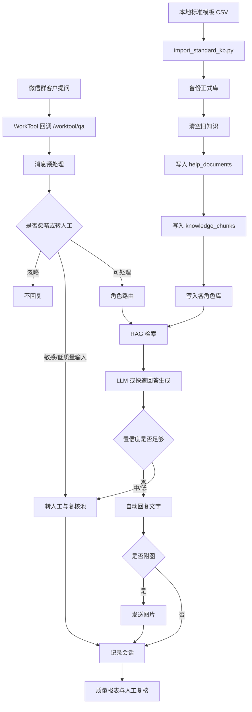

# 系统全流程说明

更新时间：2026-06-11

本文档整理当前 `worktool` 系统从知识库整理、服务器入库、线上问答、人工复核到质量回流的完整流程。适用范围是当前部署在服务器 `/home/admin/worktool` 的 RAG 问答服务，以及本地 `D:\worktool` 下的知识库整理产物。

## 1. 当前系统目标

系统目标是让企业微信群里的客户问题先由 AI 从正式知识库中检索并生成客服口径回复。高置信度问题自动回复，低置信度或敏感问题转人工，并把问题、命中知识、回答结果记录下来，后续用于人工复核和知识库迭代。

当前正式服务已经接入服务器 PostgreSQL 知识库，并通过 WorkTool 回调处理微信群消息。

## 2. 总体架构



## 3. 本地目录与关键文件

| 路径 | 用途 |
| --- | --- |
| `analysis/服务器正式知识库_标准模板规范化版.csv` | 当前重新入库的数据源，按标准模板整理后的正式知识库 |
| `analysis/服务器正式知识库_标准模板规范化版.md` | CSV 的可读版，方便人工检查 |
| `analysis/知识库标准入库模板.md` | 后续人工编写知识的标准说明 |
| `analysis/知识库标准入库模板.csv` | 标准模板字段示例 |
| `analysis/知识库标准入库空白模板.csv` | 可复制填写的空白模板 |
| `analysis/服务器正式知识库_模板重新入库预检报告.md` | 导入前 dry-run 检查报告 |
| `analysis/服务器正式知识库_模板重新入库执行报告.md` | 已执行正式导入后的报告 |
| `analysis/服务器连接检查报告.md` | 服务器连接、服务状态和导入结果记录 |
| `scripts/import_standard_kb.py` | 标准模板 CSV 导入 PostgreSQL 的脚本 |
| `src/ragbot/main.py` | FastAPI 入口，包含 `/worktool/qa`、`/rag/query` 等接口 |
| `src/ragbot/retrieval.py` | 检索服务，负责角色路由、召回、重排和置信度判断 |
| `src/ragbot/answering.py` | 回答服务，负责把检索上下文交给 LLM 生成回答 |
| `src/ragbot/workflow.py` | 微信消息工作流，负责去重、转人工、保存会话 |
| `src/ragbot/repositories.py` | PostgreSQL 和内存仓库实现 |
| `db/init/001_schema.sql` | PostgreSQL 表结构 |
| `stream/系统全流程说明.md` | 本文档 |

## 4. 服务器部署状态

服务器地址：

```text
139.196.6.90
```

服务器项目路径：

```bash
/home/admin/worktool
```

systemd 服务：

```bash
worktool-rag.service
```

服务启动命令：

```bash
/home/admin/worktool/.venv/bin/python -m uvicorn ragbot.main:app --host 0.0.0.0 --port 8000
```

当前关键配置方向：

| 配置项 | 当前用途 |
| --- | --- |
| `REPOSITORY_PROVIDER=postgres` | 使用 PostgreSQL 作为正式知识库 |
| `POSTGRES_DSN` | PostgreSQL 连接串 |
| `LLM_PROVIDER=http` | 使用 HTTP LLM 服务生成回答 |
| `EMBEDDING_PROVIDER=hash` | 当前使用 hash embedding |
| `REPLY_IMAGES_ENABLED=true` | 命中知识带图片时允许回图 |
| `FAST_IMAGE_REPLY_ENABLED=true` | 图片类高置信命中可走快速回复 |
| `BATCH_IMAGE_REPLY_ENABLED=true` | 文字与图片可批量发送 |
| `AUDIENCE_ROUTING_ENABLED=true` | 开启角色库路由 |

## 5. 知识库整理流程

当前知识库整理不是直接把服务器原始内容塞回线上库，而是分多步处理。

### 5.1 原始服务器知识库快照

原始文件：

```text
analysis/server_formal_knowledge_base.csv
analysis/server_formal_knowledge_base.md
```

这批数据来自服务器已经入库的帮助中心内容。问题是原始内容里有较多标题、宣传语、图片说明、重复块和不适合作为客服回答的说明文字。

### 5.2 清洗版

输出文件：

```text
analysis/服务器正式知识库_清洗版.csv
analysis/服务器正式知识库_清洗版.md
analysis/服务器正式知识库_清洗报告.md
analysis/服务器正式知识库_清洗摘要.json
```

清洗动作：

| 动作 | 说明 |
| --- | --- |
| 删除标题噪声 | 去掉正文开头重复标题 |
| 删除图片噪声 | 删除 `[图片: ...]` 和 `图片说明：...` |
| 保留图片元数据 | 图片只保留到 `image_refs`，不放入可检索正文 |
| 合并短块 | 同一来源下过短 chunk 合并到相邻 chunk |
| 标记重复 | 完全重复删除，近似重复标记人工复核 |

### 5.3 客服回答优化版

输出文件：

```text
analysis/服务器正式知识库_客服回答优化版.csv
analysis/服务器正式知识库_客服回答优化版.md
analysis/服务器正式知识库_客服回答优化报告.md
analysis/服务器正式知识库_客服回答优化摘要.json
```

优化目标：

| 动作 | 说明 |
| --- | --- |
| 剔除不适合回答的帮助中心内容 | 例如宣传性标题、泛介绍、入口说明 |
| 只保留每个端口指定类型 | 初次使用指南、使用技巧、热门问题、热门文章 |
| 转成客服回答口径 | 尽量形成“可以怎么操作”的回答，而不是帮助中心文章原文 |
| 标记不确定条目 | 无法确认是否适合入库的内容进入复核清单 |

### 5.4 入库候选与人工复核

输出文件：

```text
analysis/服务器正式知识库_入库候选版.csv
analysis/服务器正式知识库_入库候选版.md
analysis/服务器正式知识库_人工复核清单.csv
analysis/服务器正式知识库_人工复核清单.md
```

规则：

| 类型 | 处理方式 |
| --- | --- |
| 可直接回答的问题 | 进入入库候选 |
| 内容太泛或不完整 | 进入人工复核 |
| 需要业务确认的答案 | 进入人工复核 |
| 纯宣传或纯介绍 | 不作为回答知识入库 |

### 5.5 标准模板规范化版

当前重新入库的数据源：

```text
analysis/服务器正式知识库_标准模板规范化版.csv
analysis/服务器正式知识库_标准模板规范化版.md
analysis/服务器正式知识库_标准模板规范化报告.md
analysis/服务器正式知识库_标准模板规范化摘要.json
```

当前统计：

| 指标 | 数量 |
| --- | ---: |
| 模板总行数 | 74 |
| 可入库 | 66 |
| 待复核 | 8 |

当前已跳过的待复核知识 ID：

```text
kb-server-0007
kb-server-0008
kb-server-0009
kb-server-0014
kb-server-0022
kb-server-0054
kb-server-0055
kb-server-0059
```

## 6. 标准入库模板设计

标准模板的核心目标是让 RAG 同时满足两件事：

1. 检索容易命中。
2. 回答只使用客服可直接发送的内容。

建议字段按用途分成两类。

### 6.1 检索与管理字段

这些字段应该进入 metadata，或者只作为检索增强，不应该直接出现在最终回答里。

| 字段 | 用途 |
| --- | --- |
| 知识ID | 唯一追踪 |
| 入库状态 | 可入库、待复核、废弃 |
| 适用端口 | 老师端、学生端、教务端、销售端、校长端 |
| 角色库 | teacher、student、academic、sales、principal |
| 一类分类 | 业务分类 |
| 二级分类 | 更细模块 |
| 用户问法示例 | 提高召回，不应直接回答给客户 |
| 意图关键词 | 提高召回，不应直接回答给客户 |
| RAG检索摘要 | 帮助命中，不应直接回答给客户 |
| 关联知识ID | 用于后续联动 |
| 维护人 | 管理字段 |
| 内部备注 | 不入检索正文 |

### 6.2 可生成回答字段

这些字段可以作为最终回答上下文。

| 字段 | 用途 |
| --- | --- |
| 问题标题 | 标准问题 |
| 标准回答 | 客服可直接发送的短答案 |
| 操作步骤 | 需要步骤时使用 |
| 前置条件 | 有限制时提醒 |
| 排查项 | 使用问题排查 |
| 注意事项 | 避免误导客户 |
| 不适用场景 | 防止答错 |
| 转人工条件 | 低置信或需要后台处理时使用 |

重要原则：

```text
用户问法示例、意图关键词、RAG检索摘要不能被当成客服回答正文。
```

这也是当前截图里出现“把多个问题标题列给客户”的根本原因之一。

## 7. 正式入库流程

正式入库通过服务器上的脚本执行，当前脚本路径：

```bash
/home/admin/worktool/scripts/import_standard_kb.py
```

服务器上的模板 CSV：

```bash
/home/admin/worktool/analysis/服务器正式知识库_标准模板规范化版.csv
```

### 7.1 上传文件

本地上传到服务器：

```powershell
scp -i .ssh-deploy\worktool_deploy_ed25519 `
  analysis\服务器正式知识库_标准模板规范化版.csv `
  root@139.196.6.90:/home/admin/worktool/analysis/

scp -i .ssh-deploy\worktool_deploy_ed25519 `
  scripts\import_standard_kb.py `
  root@139.196.6.90:/home/admin/worktool/scripts/
```

### 7.2 预检 dry-run

服务器执行：

```bash
cd /home/admin/worktool
sudo -u admin .venv/bin/python scripts/import_standard_kb.py
```

预检目的：

| 检查项 | 说明 |
| --- | --- |
| CSV 是否可读 | 防止编码和表头错误 |
| 可入库数量 | 确认只导入 `可入库` |
| 待复核数量 | 确认不会误入库 |
| 正文噪声 | 检查是否仍有图片说明、空正文 |
| 角色库 | 确认每条知识能分配到对应角色库 |

### 7.3 正式导入

服务器执行：

```bash
cd /home/admin/worktool
sudo -u admin .venv/bin/python scripts/import_standard_kb.py \
  --execute \
  --clear-existing \
  --yes-clear-existing
```

执行逻辑：

1. 校验待导入记录。
2. 备份正式知识库相关表。
3. 清空旧 `help_documents` 和 `knowledge_chunks`。
4. 清空各角色知识库表。
5. 根据标准模板生成 `HelpDocument` 和 `KnowledgeChunk`。
6. 写入总知识库表。
7. 按角色写入 `knowledge_chunks_student`、`knowledge_chunks_teacher` 等角色表。
8. 生成执行报告和摘要。

### 7.4 当前导入结果

本次已执行正式入库：

| 指标 | 数量 |
| --- | ---: |
| 实际导入知识 | 66 |
| 跳过待复核 | 8 |
| student 角色库 | 43 |
| teacher 角色库 | 45 |
| academic 角色库 | 38 |
| sales 角色库 | 13 |
| principal 角色库 | 21 |

本次自动备份表：

```text
kb_backup_20260611_172908_help_documents
kb_backup_20260611_172908_knowledge_chunks
kb_backup_20260611_172908_knowledge_chunks_student
kb_backup_20260611_172908_knowledge_chunks_teacher
kb_backup_20260611_172908_knowledge_chunks_principal
kb_backup_20260611_172908_knowledge_chunks_academic
kb_backup_20260611_172908_knowledge_chunks_sales
```

## 8. 数据库表流向

正式库核心表：

| 表名 | 用途 |
| --- | --- |
| `help_documents` | 文档级记录，每条标准知识通常对应一个文档 |
| `knowledge_chunks` | 总知识 chunk 表，RAG 总库 |
| `knowledge_chunks_student` | 学生角色库 |
| `knowledge_chunks_teacher` | 老师角色库 |
| `knowledge_chunks_principal` | 校长角色库 |
| `knowledge_chunks_academic` | 教务角色库 |
| `knowledge_chunks_sales` | 销售角色库 |
| `conversation_logs` | 每次问答日志 |
| `review_items` | 需要人工复核的问题和答案 |
| `bot_rules` | 规则配置预留 |

每个知识 chunk 主要字段：

| 字段 | 用途 |
| --- | --- |
| `id` | chunk ID |
| `document_id` | 所属文档 |
| `title` | 标题 |
| `content` | 检索与生成上下文 |
| `image_refs` | 图片引用 |
| `metadata` | 分类、角色、来源、问法、关键词等 |
| `embedding` | 向量 |
| `status` | active 等状态 |

## 9. 线上问答接口流程

### 9.1 `/worktool/qa`

这是微信群正式入口。WorkTool 收到群消息后回调该接口。

主流程：

1. 解析 WorkTool 消息。
2. 判断消息是否重复。
3. 判断是否文本消息，非文本或过短消息忽略。
4. 判断是否命中转人工规则。
5. 对问题做角色路由。
6. 调用检索服务召回知识。
7. 调用回答服务生成答案。
8. 高置信度自动回复。
9. 如果知识带图片并且图片回复开关开启，发送图片。
10. 保存 `conversation_logs`。
11. 需要复核时写入 `review_items`。

### 9.2 `/rag/query`

这是调试入口，适合本地或服务器上直接验证 RAG 效果。

请求示例：

```bash
curl -s http://127.0.0.1:8000/rag/query \
  -H 'Content-Type: application/json' \
  -d '{"question":"学生如何查看错题分析？"}'
```

返回中重点看：

| 字段 | 含义 |
| --- | --- |
| `answer` | 生成答案 |
| `confidence` | high、medium、low |
| `confidence_score` | 置信分 |
| `auto_reply` | 是否会自动回复 |
| `needs_human` | 是否需要人工 |
| `cited_chunk_ids` | 命中知识 |
| `routed_audiences` | 路由到的角色库 |

### 9.3 `/knowledge/documents`

这是通用文档入库接口，目前标准模板重建库主要走 `scripts/import_standard_kb.py`，不是直接走该接口。

### 9.4 `/conversations`

查看最近问答日志，用于排查某个问题命中了哪些 chunk。

### 9.5 `/quality/report`

生成质量统计报告，用于发现高频低置信、转人工、无命中的问题。

## 10. 检索流程

检索服务在 `src/ragbot/retrieval.py`。

主要逻辑：

1. 如果开启角色路由，先判断问题适合哪些角色库。
2. 加载 query aliases，对常见问法做扩展。
3. 生成 query embedding。
4. 从 PostgreSQL 候选 chunk 中召回。
5. 对候选进行关键词分、向量分、标题加权、操作类问题加权。
6. 排序取 top-k。
7. 根据分数判断 high、medium、low。
8. high 才有机会自动回复。

当前风险：

| 风险 | 影响 |
| --- | --- |
| 标题过泛 | 容易误命中帮助中心文章 |
| 元信息进入正文 | LLM 可能把“用户问法示例”当回答 |
| 图片引用过多 | 命中后可能自动发出不必要截图 |
| 缺少业务问题覆盖 | 无命中或转人工 |

## 11. 回答生成流程

回答服务在 `src/ragbot/answering.py`。

逻辑：

1. 如果检索置信度 low，不生成回答，转人工。
2. 如果置信度 medium 或 high，把命中 chunk 正文传给 LLM。
3. LLM 根据上下文生成答案。
4. high 自动回复。
5. medium 生成草稿但需要人工。

当前需要优化的关键点：

```text
传给 LLM 的上下文应只包含可回答内容，不应包含“用户可能问法”“意图关键词”“检索摘要”等元信息。
```

建议二次改造：

| 改造项 | 目标 |
| --- | --- |
| `answer_content` | 只放标准回答、操作步骤、注意事项、转人工条件 |
| `search_text` | 放问题标题、问法示例、关键词、检索摘要 |
| `metadata` | 放角色、分类、来源、维护信息 |
| 回答前清洗 | 生成前只取 `answer_content` |
| 图片条件发送 | 只有客户明确要截图或步骤必须截图时才发 |

## 12. 图片回复流程

图片存储在 chunk 的 `image_refs` 中，不应该进入正文。

当前开关允许命中后回图：

```text
REPLY_IMAGES_ENABLED=true
FAST_IMAGE_REPLY_ENABLED=true
BATCH_IMAGE_REPLY_ENABLED=true
```

这会导致一个现象：只要问题命中的知识带图片，系统可能在文字后自动发送截图。

建议后续改造：

| 场景 | 建议 |
| --- | --- |
| 用户问“怎么操作” | 先回文字步骤，图片可选 |
| 用户问“截图发我” | 可以回图 |
| 知识正文已经能说清 | 不自动回图 |
| 命中多个相近帮助中心截图 | 不批量发图 |

## 13. 人工复核与质量闭环

每次问答会进入 `conversation_logs`。低置信、敏感问题或需要人工的问题进入 `review_items`。

闭环流程：

1. 查看 `/quality/report` 找到高频低置信问题。
2. 查看 `/conversations` 确认实际命中 chunk。
3. 判断是知识缺失、知识不准，还是检索误命中。
4. 在标准模板中新增或修改知识。
5. 生成规范化 CSV。
6. dry-run 预检。
7. 正式导入。
8. 用固定问题集回归测试。

建议维护一个回归测试问题集，至少包含：

| 问题 | 目标 |
| --- | --- |
| 订单退费怎么操作 | 应命中订单/退费知识 |
| 学生如何查看错题分析 | 应命中学生端错题分析 |
| 常用作业如何设置 | 应命中老师端作业 |
| 家长端怎么绑定学生 | 当前缺口，应补知识 |
| 学生准备续课系统怎么操作 | 当前缺口，应补知识 |
| 老师怎么添加机构教研资料 | 当前误答，应优化元信息和图片策略 |

## 14. 当前已知问题

### 14.1 模板正文仍混入检索元信息

当前导入脚本会把多类字段拼进 `content`，包括：

```text
问题
用户可能问法
意图关键词
检索摘要
标准回答
操作步骤
前置条件
排查项
注意事项
不适用场景
转人工条件
```

这会提高召回，但也会导致 LLM 把“用户可能问法”当成回答内容。例如客户问“老师怎么添加机构教研资料”时，系统可能回复多个问题标题，而不是直接给操作步骤。

建议修复：

1. 保留这些字段到 metadata。
2. 新增或生成专门的可回答正文。
3. 回答生成只读取可回答正文。
4. 检索仍可以使用问法示例和关键词。

### 14.2 部分业务问题仍缺知识

当前测试发现：

| 问题 | 状态 |
| --- | --- |
| 学生准备续课系统怎么操作 | 仍可能转人工 |
| 家长端怎么绑定学生 | 仍可能转人工 |
| 老师怎么添加机构教研资料 | 可能误命中帮助中心标题 |

这些问题应进入下一轮标准模板补充。

### 14.3 图片自动回复需要收敛

截图可以辅助操作，但不应该成为默认回答。否则客户可能先收到一段泛化文字，再收到不一定对应问题的截图。

建议把图片回复改成：

```text
仅当知识标记为“必须截图”或用户明确要图时发送。
```

## 15. 运维命令

### 15.1 SSH 登录

```powershell
ssh -i .ssh-deploy\worktool_deploy_ed25519 root@139.196.6.90
```

### 15.2 查看服务

```bash
systemctl status worktool-rag --no-pager
```

### 15.3 查看实时日志

```bash
journalctl -u worktool-rag -f
```

### 15.4 重启服务

```bash
systemctl restart worktool-rag
```

### 15.5 健康检查

```bash
curl -s http://127.0.0.1:8000/health
```

正常返回：

```json
{"status":"ok"}
```

### 15.6 RAG 查询测试

```bash
curl -s http://127.0.0.1:8000/rag/query \
  -H 'Content-Type: application/json' \
  -d '{"question":"学生如何查看错题分析？"}'
```

### 15.7 查看最近会话

```bash
curl -s 'http://127.0.0.1:8000/conversations?limit=10'
```

### 15.8 查看质量报告

```bash
curl -s 'http://127.0.0.1:8000/quality/report?limit=100&top=10'
```

### 15.9 数据库统计

```bash
cd /home/admin/worktool
sudo -u admin .venv/bin/python - <<'PY'
from ragbot.config import get_settings
import psycopg

settings = get_settings()
tables = [
    "help_documents",
    "knowledge_chunks",
    "knowledge_chunks_student",
    "knowledge_chunks_teacher",
    "knowledge_chunks_principal",
    "knowledge_chunks_academic",
    "knowledge_chunks_sales",
]
with psycopg.connect(settings.postgres_dsn) as conn:
    for table in tables:
        count = conn.execute(f"select count(*) from {table}").fetchone()[0]
        print(table, count)
PY
```

## 16. 安全与回滚

正式导入前必须满足：

1. CSV 已通过 dry-run。
2. `待复核` 不参与正式导入。
3. 导入脚本会先创建备份表。
4. 执行报告已保存到本地 `analysis` 目录。

如果需要回滚，原则上使用本次导入前的备份表恢复：

```text
kb_backup_20260611_172908_*
```

回滚前应先停止服务或确认没有新的写入操作，并再次备份当前表。

## 17. 后续推荐执行顺序

建议下一步不要急着继续扩大知识量，而是先解决回答质量结构问题。

优先级：

1. 修改标准模板导入逻辑，拆分检索文本和回答正文。
2. 重新生成一版“回答正文纯净版” CSV。
3. 只把标准回答、操作步骤、注意事项、转人工条件提供给 LLM。
4. 收紧图片自动回复策略。
5. 补齐当前低命中问题：续课、家长绑定、机构教研资料。
6. 建立 20 到 50 条固定回归问题集。
7. 每次导入后自动跑回归测试，再决定是否上线。

推荐新的知识结构：

```text
search_text = 问题标题 + 用户问法示例 + 意图关键词 + RAG检索摘要
answer_content = 标准回答 + 操作步骤 + 前置条件 + 排查项 + 注意事项 + 转人工条件
metadata = 分类 + 角色库 + 来源 + 维护信息 + 质量标签
image_refs = 图片元数据
```

这样既能保证检索命中，又能避免把“问题列表、标题、宣传语、截图说明”直接回复给客户。

